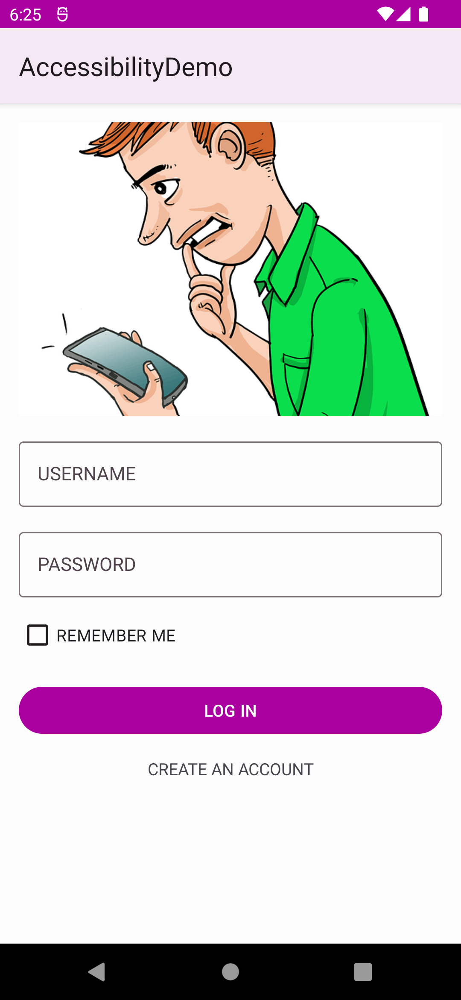

# Accessibility on Android
Sample demo for my talk on Accessibility at KotlinKenya/Android-254 event on 23rd April.

# Description
This project consists of two apps that have a user form. The folders are as follows:

- App-Compose - [Jetpack Compose]() version of the app.
- AppViews - Traditional View-based system.

# Instructions
In order to run the project simply follow these steps:

- Open Terminal / CMD

        git clone https://github.com/otsembo/KotlinKenyaAccessibility.git

- Navigate to the directory

        cd KotlinKenyaAccessibility

- Launch Android Studio and Select Project flavor of choice

# Screenshot

# License
This project is published under [MIT](https://en.wikipedia.org/wiki/MIT_License) license.